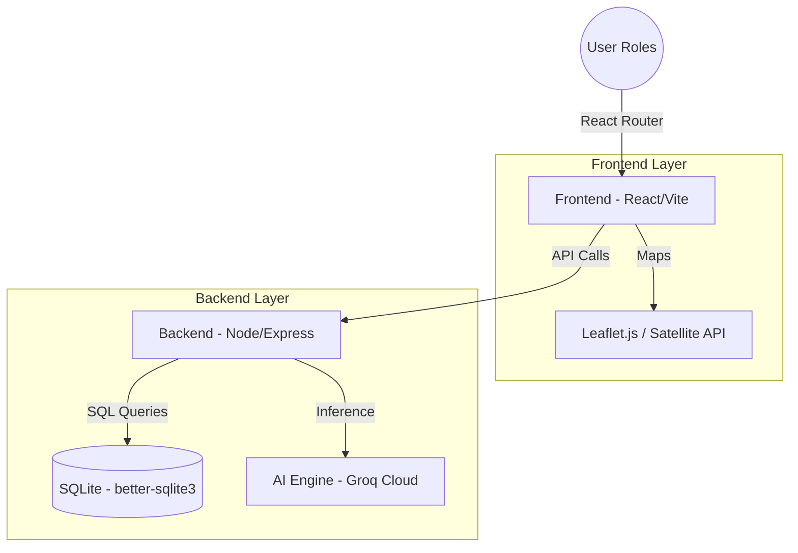

<div align="center">


# 🌿PARIVESH 3.0

[](https://opensource.org/licenses/MIT)
[](https://react.dev/)
[](https://expressjs.com/)
[](https://groq.com/)
[](https://www.sqlite.org/)

**The Next-Generation Environmental Clearance Intelligence Portal.**
*Streamlining MoEFCC clearances with AI-driven risk analysis, transparent monitoring, and real-time GIS insights.*

[Explore Features](#-key-features) • [View Architecture](#-system-architecture) • [Local Setup](#-local-setup) • [Deployment](#-deployment-guide)

</div>

---

## 📖 Overview

**PARIVESH 3.0** is a sophisticated digital ecosystem reimagining the environmental clearance process for the **Ministry of Environment, Forest and Climate Change (MoEFCC)**, Government of India. It bridges the gap between complex regulatory requirements and efficient project approvals using cutting-edge AI and GIS technologies.

### Why PARIVESH 3.0?
- **Speed**: AI-automated summaries and risk scoring reduce manual review time.
- **Transparency**: Public dashboards allow citizens to monitor environmental impact in real-time.
- **Accuracy**: GIS-based land-use tracking ensures "Before vs. After" verification is undeniable.

---

## ✨ Key Features

### 🤖 AI-Driven Intelligence
- **AI Risk Scoring**: Automatically evaluates projects based on topography, local pollution metrics, and forest density impact.
- **AI Permit Advisor**: An interactive guide that identifies necessary clearances (Environmental, Forest, Wildlife) for any project type.
- **Meeting Gist**: Instantly generates concise, actionable summaries from lengthy environmental review committee meetings.

### 🛰️ GIS & Monitoring
- **Satellite Comparison**: Interactive viewer for monitoring deforestation and land-use changes over time.
- **IoT Integration**: Mocked sensor data streams for real-time air and water quality monitoring at project sites.
- **GIS Map Layers**: Visualize project boundaries against protected forest zones and wildlife corridors.

### 👥 Multi-Role Dashboards
- **Regulator Portal**: Advanced tools for reviewing applications, analyzing AI risk scores, and issuing clearances.
- **Applicant Suite**: Streamlined document submission, real-time status tracking, and AI-assisted compliance checks.
- **Citizen Hub**: Public transparency portal for project exploration, public comments, and AI-verified complaint submission.

### ⚙️ User Management
- **My Profile**: Centralized hub for managing personal information, roles, and verification status.
- **System Settings**: Configurable security, notification, and regional settings to personalize the PARIVESH 3.0 experience.
- **Role-Based Access**: Seamlessly switch or view context-specific tools based on authenticated government or public roles.

---

## 🏗️ System Architecture

PARIVESH 3.0 follows a modern, decoupled architecture designed for scale and maintainability.



---

## 🛠️ Tech Stack

| Type | Technology | Purpose |
| :--- | :--- | :--- |
| **Frontend** | `React 19`, `Vite`, `Tailwind CSS` | UI/UX & Responsive Design |
| **Animations** | `Framer Motion` | Smooth transitions & Micro-interactions |
| **Icons** | `Lucide React` | Consistent iconography |
| **Backend** | `Node.js`, `Express 5` | RESTful API Layer |
| **Database** | `Better-SQLite3` | High-performance local storage |
| **AI Backend** | `Groq AI (Llama-3/Mixtral)` | Intelligent analysis & Summarization |
| **Maps** | `Leaflet`, `React-Leaflet` | GIS Visualization |

---

## 🚀 Local Setup

Follow these steps to get a local development environment running.

### 1. Prerequisites
- Node.js (v18+)
- npm or yarn

### 2. Installation
```bash
# Clone the repository
git clone https://github.com/sourabh-sahu-08/Ecotrack.git
cd Ecotrack

# Install root & workspace dependencies
npm install
```

### 3. Environment Configuration
Create a `.env` file in the `backend/` directory:
```env
PORT=5000
GROQ_API_KEY=your_groq_api_key_here
JWT_SECRET=your_super_secret_key
NODE_ENV=development
```

### 4. Launching the App
```bash
# Start both Frontend and Backend concurrently
npm run dev
```
- **Frontend**: [http://localhost:5173](http://localhost:5173)
- **Backend API**: [http://localhost:5000](http://localhost:5000)

---

## 🌐 Deployment Guide

### **Backend (Render)**
1. Connect your repo and set the root directory to `backend`.
2. **Build Command**: `npm install; npm run build` (if using TS) or just `npm install`.
3. **Start Command**: `npm start`.
4. Configure environment variables (`GROQ_API_KEY`, `JWT_SECRET`).

### **Frontend (Vercel)**
1. Set the root directory to `frontend`.
2. Add environment variable `VITE_API_URL` pointing to your deployed Backend.
3. Vercel will auto-detect the Vite build settings.

---

## 📁 Project Structure

```text
Ecotrack/
├── frontend/           # React + Vite application
│   ├── src/
│   │   ├── components/ # Reusable UI components
│   │   ├── pages/      # Dashboard and view implementations
│   │   └── services/   # API integration layer
├── backend/            # Express.js Server
│   ├── server.ts       # Main entry point
│   ├── routes/         # API Route definitions
│   └── database/       # SQLite schema and initialization
├── package.json        # Root workspace configuration
└── README.md           # You are here!
```

---

## 🤝 Contributing

We welcome contributions! Please feel free to submit a Pull Request.

1. Fork the Project
2. Create your Feature Branch (`git checkout -b feature/AmazingFeature`)
3. Commit your Changes (`git commit -m 'Add some AmazingFeature'`)
4. Push to the Branch (`git origin push feature/AmazingFeature`)
5. Open a Pull Request

---

<div align="center">
  <p><i>Developed for the Ministry of Environment, Forest and Climate Change (MoEFCC)</i></p>
  <p>© 2026 EcoTrack · Promoting Environmental Efficiency through Digital Innovation.</p>
</div>
